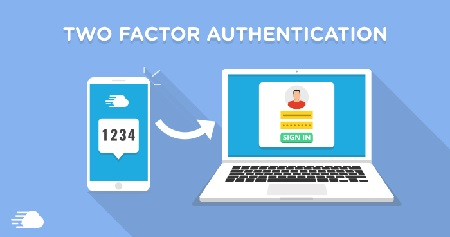

<!-- $theme: gaia -->

# Two-Factor-Authentication (2FA) :lock:

##### Marc-Niclas Harm
##### Kryptologie | TH-Luebeck
##### 29.11.2018

---

# Gliederung :pushpin:

- Wozu **2FA**:question:
- Was ist **2FA**:question:
- Algorithmus-Beispiel: **TOTP** (und **HOTP**)
- Anwendungen fuer **TOTP**
- Weitere **2FA** Moeglichkeiten
  - SMS, Anruf, E-Mail, Hardware Token

---

# Wozu **2FA**:question:

- Verlust von persönlichen Daten bei Unternehmen immer zahlreicher
- Internetkriminalitaet wird anspruchsvoller
- Datenverlust oder Identitätsdiebstahl für Verbraucher verheerend
- Passwoerter allein *nicht* ausreichend zum Schutz von Daten

:arrow_right: **2FA** als zusätzlicher Schutz

---

# Was ist 2FA:question:

---

# Quellen
#### Bildquellen
- https://www.cloudways.com/blog/wp-content/uploads/Two-Factor-Authentication-Banner.jpg