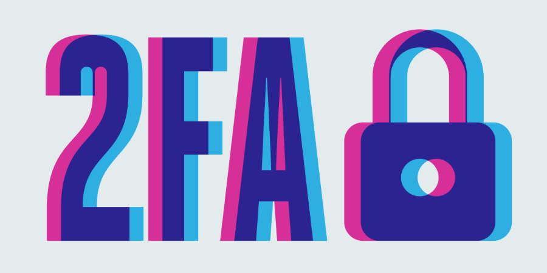
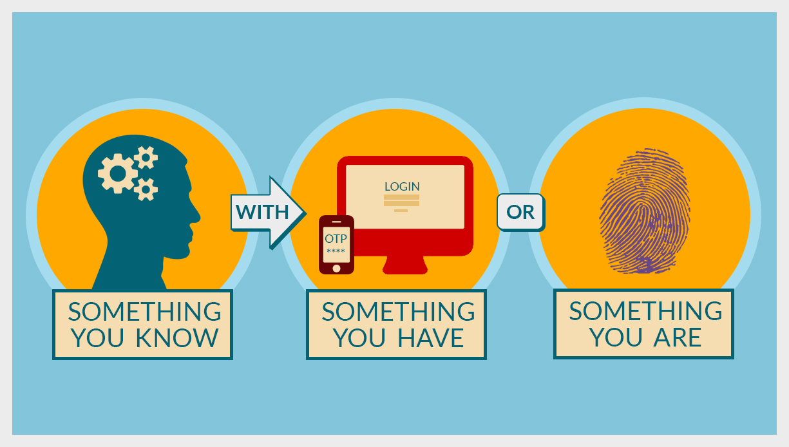
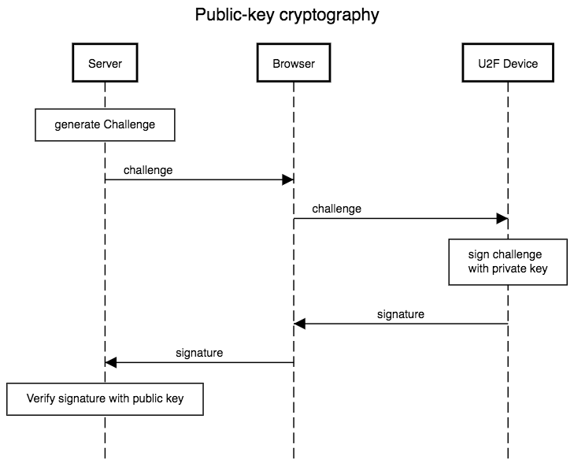
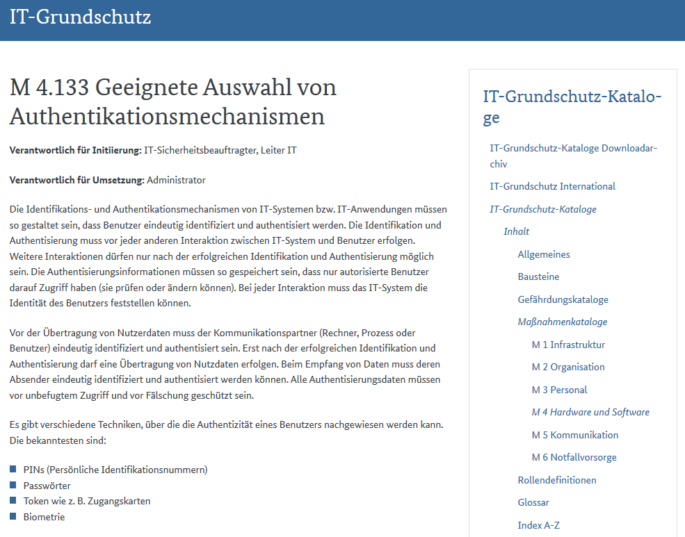
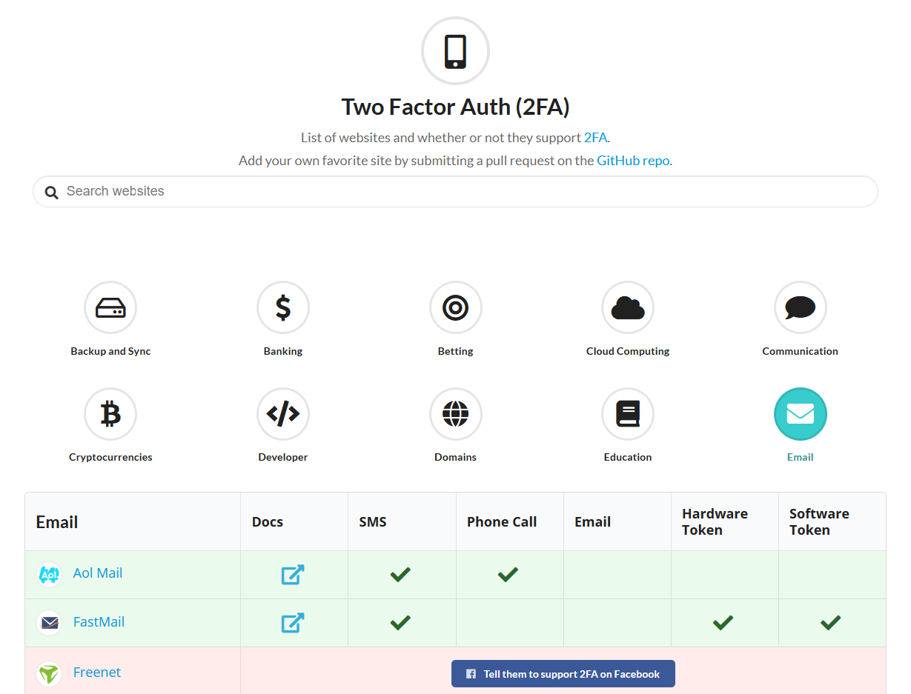

# Two-Factor-Authentication

###### Marc-Niclas Harm | 29.11.2018 | TH-Luebeck

---

# Gliederung :pushpin:

- Was ist **2FA**?
- Wieso überhaupt **2FA**?
- Algorithmus-Beispiel: **TOTP** (anhand von **HOTP**)
- Anwendungen fuer **TOTP**
- Weitere **2FA** Moeglichkeiten
  - SMS, Anruf, E-Mail, Hardware Token

---

# Was ist **2FA**:question:

- Unterkategorie der **Multi-Factor-Authentication** (**MFA**)
- Dient der Bestätigung der Identität eines Nutzers
- Bestehend aus mind. **zwei** unabhängigen Faktoren

||||
|:-:|:-:|:-:|
|**Wissen** :key:|**Besitz** :credit_card:|**Inhärenz** :eyes:

---

# Was ist **2FA**:question:

---

# Wieso überhaupt **2FA**:question:

- Verlust von persönlichen Daten bei Unternehmen immer zahlreicher
- Internetkriminalitaet wird anspruchsvoller
- Datenverlust oder Identitätsdiebstahl für Verbraucher verheerend
- Selten unterschiedliche Passwörter
- Passwoerter allein **nicht** ausreichend zum Schutz von Daten

:arrow_right: **2FA** als zusätzlicher Schutz

---

# Algorithmus-Beispiel:
# **TOTP** (anhand von **HOTP**)

---

# Kurz: Was ist ein Hash:question:

- Jeder Input ergibt immer denselben Output (**Determinismus**)
- Aus einem gegebenen Hash (Output) den Input zurueckzuerhalten ist rechnerisch nicht machbar (**Einwegfunktion**)
- Kleine Aenderung im Onput, fuehrt zu drastischer Aenderung im Output (**keine Korrelation**)

---

# HOTP (RFC 4226 aus dem Jahr 2005)

> HMAC-Based One-Time Password

$$HOTP(K,C) = Truncate(HMAC-SHA-1(K,C))$$

|Name|Beschreibung|
|:-:|:-|
|**K**|Schluessel|
|**C**|Zaehler|
|**HMAC**|Keyed-Hash Message Authentication Code|
|**SHA-1**|Secure Hash Algorithm 1|
|**Truncate**|Konvertiert Hash in Einmalpasswort|

---

# Nachteile von HOTP

- Generiertes Einmalpasswort ist solange gültig bis ein neues generiert wird
- Alle moeglichen Einmalpasswoerter mittels **Brute-Force** ausprobieren
	- Anbieter sollten Zugang nach einigen Fehlversuchen für ein bestimmtes Zeitintervall sperren

---

# TOTP (RFC 6238 aus dem Jahr 2011)

> Time-Based One-Time Password Algorithm

$$TOTP = HOTP(K,T)$$
$$T = Floor((Unixtime(Now) - Unixtime(T0)) / TI)$$

|Name|Beschreibung|
|:-:|:-|
|**K**|Schluessel|
|**Now**|Aktuelles Datum & Zeit|
|**T0**|1. Januar 1970, 00:00 Uhr UTC (Start der Unixzeit)|
|**T1**|Gültigkeitsintervall|
|**Unixtime**|Konvertiert Datum & Zeit in Unix-Zeitstempel|
|**Floor**|Rundet auf die naechste ganze Zahl ab|

---

# Vorteile von TOTP

- Jedes generiertes Passwort ist nur in einem **bestimmten, kurzen** Intervall gültig
- Auch hier **Brute-Force-Methode** moeglich, solange die Durchsatzrate an Einmalpasswoerten nicht begrenzt wird

---

# Live-Demo :boom:

---

# Anwendungen fuer TOTP

- // ANWENDUNGEN

---

# Weitere **2FA** Moeglichkeiten

- **SMS**, **Anruf**, **E-Mail**
	- Zusendung des Einmalpassworts nach Eingabe der Telefonnummer/E-Mail
- **Hardwaretoken**
	- Identifizierung und Authentifizierung von Benutzern mittels einer Hardwarekomponente
	- Bekanntes Beispiel: **U2F-Standard der FIDO-Allianz**
	

---

# U2F-Standard

---

### Welche Mechanismen waehlen:question:

---

### https://twofactorauth.org

---

# Quellen :clipboard:

#### Bildquellen

- https://www.eff.org/files/2016/12/08/2fa-1.png
- https://www.safetynet-inc.com/wp-content/uploads/2017/08/Two-Factor-Authentication.jpg
- https://steemitimages.com/DQmaVQoXdxoT3oPQd6h6yxnhpAavnhBWvkkzsrMQaj113sS/Public-key%20cryptography.png
- https://www.mtrix.de/wp-content/uploads/2017/09/hardware-yubikeys-2.jpg

---

# Quellen :clipboard:

#### Textquellen 1

- https://authy.com/what-is-2fa/
- https://itsecblog.de/2fa-zwei-faktor-authentifizierung-mit-totp/
- https://www.bsi.bund.de/DE/Themen/ITGrundschutz/ITGrundschutzKataloge/Inhalt/_content/m/m04/m04133.html
- https://digitalguardian.com/blog/uncovering-password-habits-are-users-password-security-habits-improving-infographic

---

# Quellen :clipboard:

#### Textquellen 2

- https://www.allthingsauth.com/2018/04/20/a-medium-dive-on-the-totp-spec/

---

# Vielen Dank!